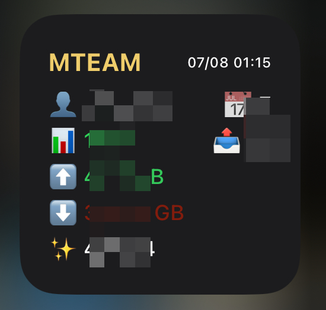

# M-Team Scriptable 小组件

🌐 **Language / 语言**: [中文](#中文版本) | [English](#english-version)

一个用于显示M-Team用户信息的iOS Scriptable小组件。

## 中文版本

## 功能特点

- 🏆 显示用户基本信息（用户名、ID、加入天数）
- 📤 展示发布数量和魔力值
- 📊 显示上传量、下载量和分享率
- 🕐 显示最后更新时间
- 🎨 美观的深色主题界面
- 📱 完美适配iOS小尺寸组件

## 使用方法

### 1. 安装Scriptable
在App Store下载并安装Scriptable应用。

### 2. 创建脚本
1. 打开Scriptable应用
2. 点击右上角的"+"按钮创建新脚本
3. 将`M-Team-Widget.js`中的代码复制到新脚本中
4. 给脚本命名（例如：M-Team Widget）

### 3. 获取API Key
1. 登录M-Team网站
2. 在用户“实验室”中找到“存取令牌”
3. 生成并复制您的API Key（存取令牌）

### 4. 添加小组件
1. 在iOS主屏幕上长按空白区域
2. 点击左上角的"+"按钮
3. 搜索并选择"Scriptable"
4. 选择"小"尺寸组件
5. 点击"添加小组件"

### 5. 配置小组件
1. 长按刚添加的小组件
2. 选择"编辑小组件"
3. 在"Script"中选择您创建的脚本
4. 在"Parameter"中输入您的API Key
5. 点击"完成"

## 界面说明

小组件将显示以下信息：

- **标题栏**: MTEAM + 最后更新时间
- **第一行**: 👤 用户名 + 📅 加入天数
- **第二行**: 📊 分享率（绿色≥1.0，红色<1.0）+ 📤 发布数量
- **第三行**: ⬆️ 上传量 + 📫 未读消息数量
- **第四行**: ⬇️ 下载量
- **第五行**: ✨ 魔力值

## 错误处理

- 如果未设置API Key，将显示红色错误提示
- 如果API请求失败，将显示错误信息
- 网络问题会自动重试

## 隐私与安全

- API Key仅用于请求M-Team API
- 不会收集或存储任何个人信息
- 所有数据请求都是直接与M-Team服务器通信

## 故障排除

### 小组件显示"❌ Please set the API Key first."
确保在小组件参数中正确输入了您的API Key。

### 小组件显示"❌ Data load failed."
1. 检查API Key是否正确
2. 确认网络连接正常
3. 验证M-Team API服务是否正常

### 数据不更新
iOS会自动刷新小组件，但您也可以：
1. 长按小组件选择"刷新"
2. 或者重新配置小组件

## 技术细节

- 使用M-Team API: 
  - `https://api.m-team.cc/api/member/profile` (用户信息)
  - `https://api.m-team.cc/api/msg/notify/statistic` (消息统计)
- 支持的组件尺寸: 小（Small）
- 自动格式化字节单位（B, KB, MB, GB, TB）
- 自动计算加入天数
- 分享率精确到小数点后2位
- 消息API失败时自动降级运行

## 更新日志

### v1.0.1
- 新增未读消息提醒

### v1.0.0
- 首次发布
- 支持所有基本功能
- 适配小尺寸组件

---

## English Version

An iOS Scriptable widget for displaying M-Team user information.

## Features

- 🏆 Display basic user information (username, join days)
- 📤 Show upload count and bonus points
- 📊 Display upload/download amounts and share ratio
- 🕐 Show last update time
- 🎨 Beautiful dark theme interface
- 📱 Perfect fit for iOS small size widgets

## How to Use

### 1. Install Scriptable
Download and install the Scriptable app from the App Store.

### 2. Create Script
1. Open Scriptable app
2. Tap the "+" button in the top right corner to create a new script
3. Copy the code from `M-Team-Widget.js` into the new script
4. Name the script (e.g., "M-Team Widget")

### 3. Get API Key
1. Log in to M-Team website
2. Find "Access Token" in user "Lab"
3. Generate and copy your API Key (Access Token)

### 4. Add Widget
1. Long press on empty space on iOS home screen
2. Tap the "+" button in the top left corner
3. Search for and select "Scriptable"
4. Select "Small" size widget
5. Tap "Add Widget"

### 5. Configure Widget
1. Long press on the newly added widget
2. Select "Edit Widget"
3. Select your created script in "Script"
4. Enter your API Key in "Parameter"
5. Tap "Done"

## Interface Description

The widget will display the following information:

- **Title bar**: MTEAM + Last update time
- **First row**: 👤 Username + 📅 Join days
- **Second row**: 📊 Share ratio (green ≥1.0, red <1.0) + 📤 Upload count
- **Third row**: ⬆️ Upload amount + 📫 Unread messages count
- **Fourth row**: ⬇️ Download amount
- **Fifth row**: ✨ Bonus points

## Error Handling

- If API Key is not set, a red error message will be displayed
- If API request fails, error information will be shown
- Network issues will automatically retry

## Privacy & Security

- API Key is only used for M-Team API requests
- No personal information is collected or stored
- All data requests communicate directly with M-Team servers

## Troubleshooting

### Widget shows "❌ Please set the API Key first."
Make sure you have correctly entered your API Key in the widget parameters.

### Widget shows "❌ Data load failed."
1. Check if the API Key is correct
2. Confirm network connection is working
3. Verify M-Team API service is running normally

### Data not updating
iOS automatically refreshes widgets, but you can also:
1. Long press the widget and select "Refresh"
2. Or reconfigure the widget

## Technical Details

- Uses M-Team API: 
  - `https://api.m-team.cc/api/member/profile` (User profile)
  - `https://api.m-team.cc/api/msg/notify/statistic` (Message statistics)
- Supported widget size: Small
- Automatically formats byte units (B, KB, MB, GB, TB)
- Automatically calculates join days
- Share ratio precise to 2 decimal places
- Graceful degradation when message API fails

## Changelog

### v1.0.1
- Added unread message notifications

### v1.0.0
- Initial release
- Support for all basic features
- Adapted for small size widgets
